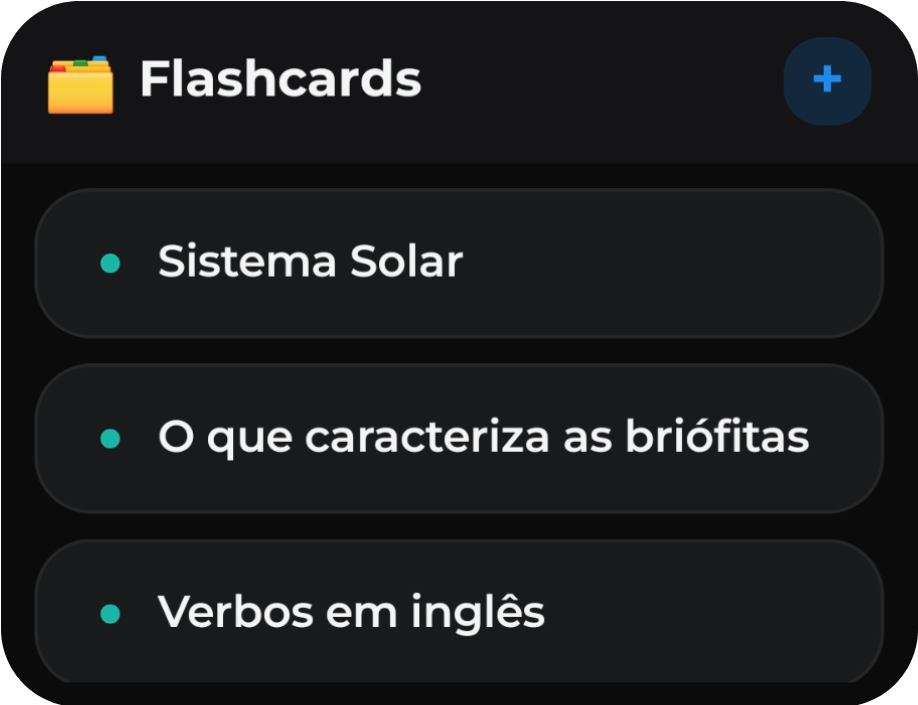
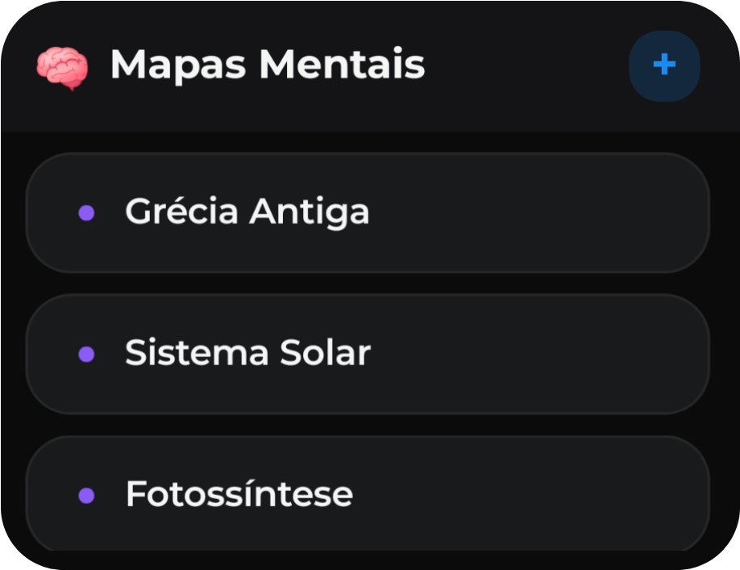

<div align="center">
  
  <h1>Genly</h1>
  <p><strong>Um aplicativo inteligente para organização acadêmica, financeira e pessoal.</strong></p>

  []()
  []()
  []()
  []()
</div>

---

## 🚀 Sobre o Projeto

O **Genly** é um aplicativo móvel voltado para produtividade, finanças e estudos. Desenvolvido em React Native, sua arquitetura é fundamentada no conceito *offline-first*, garantindo privacidade e processamento local dos dados através de SQLite. O principal foco do Genly é a integração com Inteligência Artificial (via API key) para otimizar fluxos de trabalho, como extração de textos, geração de notas, geração de mapas mentais e flashcards.

---

## ✨ Principais Funcionalidades

### 📚 Estudos e Produtividade
*   **Anotações e Tarefas:** Suporte a Markdown, equações matemáticas (LaTeX), anexos de mídia e organização flexível em grupos ou pastas.
*   **Mapas Mentais:** Telas interativas para planejamento visual. Suporta arrasto dinâmico de nós, expansão/retração de ramos, imagens inseridas e **geração contextual de mapas inteiros via IA**, com possibilidade de exportação visual.
*   **Leitor de PDF Avançado:** Ferramenta robusta para leitura e marcação de documentos, contendo caneta interativa, marca-texto, borracha e exportação final do documento renderizado.
*   **Método Pomodoro Integrado:** Temporizador animado e focado na retenção de estudos para manter o fluxo sem alternar entre aplicativos.
*   **Extração de Texto (OCR):** Reconhecimento óptico em imagens (câmera ou galeria) com pós-processamento via IA para converter mídia visual em notas estruturadas.

### 💰 Finanças Pessoais
*   **Dashboard Financeiro:** Visualização clara das receitas, despesas e saldo atual com categorização dinâmica.

### ⚙️ Sistema e Ferramentas Destaque

*   **Captura via "Share to":** O app funciona de forma persistente como alvo de compartilhamento no sistema operacional nativo para coletar imagens, PDFs e textos externos.
*   **Integração por Widgets:** Acesso instantâneo a finanças e notas recentes a partir da tela principal (Android Widgets).
*   **Autenticação Biométrica:** Módulo nativo de criptografia e proteção por impressão digital/reconhecimento facial para blindar informações seletas do banco de dados.
*   **Backup Offline Completo:** Compressão, exportação e importação de todo o banco relacional e da base de mídia pesada (imagens e documentos) em formato ZIP, garantindo a interoperabilidade entre dispositivos.
*   **Recursos Acessórios:** Temas Claro/Escuro personalizáveis por *Accent Colors* e um Scanner Rápido Multiuso para leitura de QR Codes e Barcodes de infraestrutura.

---

## 📱 Screenshots

### Home
<div align="center">

</div>

### Widgets
<div align="center">

  
  
  
  
  
</div>

---

## 🛠️ Ciclo de Release e Atualizações (In-App Updates)

O Genly implementa um serviço em segundo plano focado no escrutínio das **[Releases Públicas do Repositório](https://github.com/jefersonapps/genly/releases/)**. Em vez de depender das grandes lojas de aplicativos, o próprio app notifica o usuário sobre a disponibilidade de uma nova versão e media o processo de instalação nativa de forma amigável.

Para realizar o deploy e acionar a distribuição da versão para todos os clientes ativos, é estritamente necessário seguir os passos de versionamento abaixo.

### 1. Atualizar as Definições Locais
As flags de versão precisam ser modificadas primeiramente no código-fonte para refletir a numeração futura.

No arquivo `app.json`:
- `"version": "V.X.X"`: Avance um incremento semântico (ex: para `"1.0.1"`). **Este valor exato deve ser o nome da tag (release target) do GitHub**.
- `"versionCode": XX`: Avance numéricamente (ex: `2`). Este identificador canônico é lido pelo sistema operacional Android e deve sempre crescer em magnitude para requerer prioridade e possibilitar que a nova compilação sobreponha e atualize o aplicativo estático pré-existente no dispositivo.

No arquivo `package.json`:
- `"version": "V.X.X"`: Sincronize refletindo a nova versão recém definida (ex: `"1.0.1"`).

### 2. Efetuar o Build de Distribuição
Compile o novo *bundle* para ambiente de produção (Release). 

```bash
# Limpeza geral de recursos locais nativos (Opcional, mas recomendado)
cd android && ./gradlew clean && cd ..

# Inicia a criação e o empacotamento estático do APK final
cd android && ./gradlew assembleRelease
```
> O artefato (APK) de saída será injetado no diretório absoluto: `android/app/build/outputs/apk/release/app-release.apk`
> *Nota: Garantir assinatura de builds em produção usando a keystore JKS correta nas variáveis de ambiente.*

### 3. Publicar o Artefato (GitHub Releases)
- Acesse e crie um novo **Draft** na aba de *Releases* deste repositório no GitHub.
- Insira em **Tag version** rigorosamente o mesmo valor adicionado na diretriz `version` configurada passo 1.
- Especifique as adições, correções de bugs, e manutenções feitas ao longo do log como título e descrição principal do formulário (nota: O Genly **extrairá nativamente esta string interativamente via API sob demanda** para exibir ao usuário dentro do aplicativo na notificação modal de novas Notas de Atualização).
- Realize o upload inserindo o binário compilado (`app-release.apk`) no bloco de assets.
- Confirme a submissão marcando a opção **Publish Release**.

A partir deste registro público, qualquer instância pré-instalada consumirá as informações atualizadas pelas rotas e engatilhará as diretrizes internas assíncronas de download e substituição do serviço nativo.

---

## 💻 Stack Tecnológico
- **Frontend e Views:** React Native (Expo SDK) | React Navigation
- **Data Layer:** SQLite Nativo | Drizzle ORM
- **State Management:** Zustand
- **Graphics e Animações:** React Native Skia | React Native Reanimated
- **Integração de SO:** React Native Blob Util | Document Scanner | Android Custom Widgets
- **Styling:** Tailwind CSS integrado (NativeWind)

---

